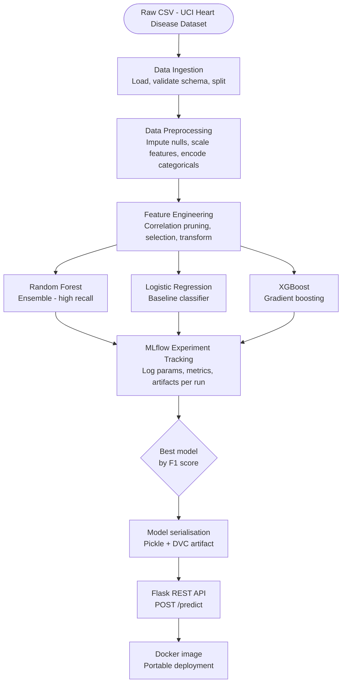
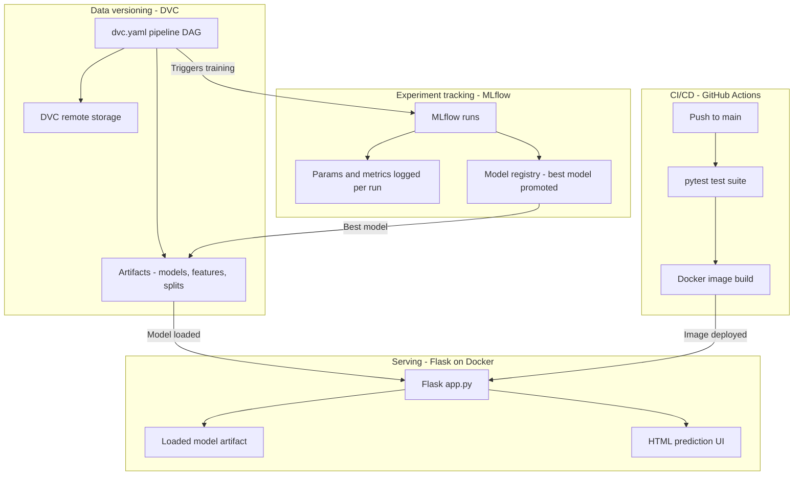
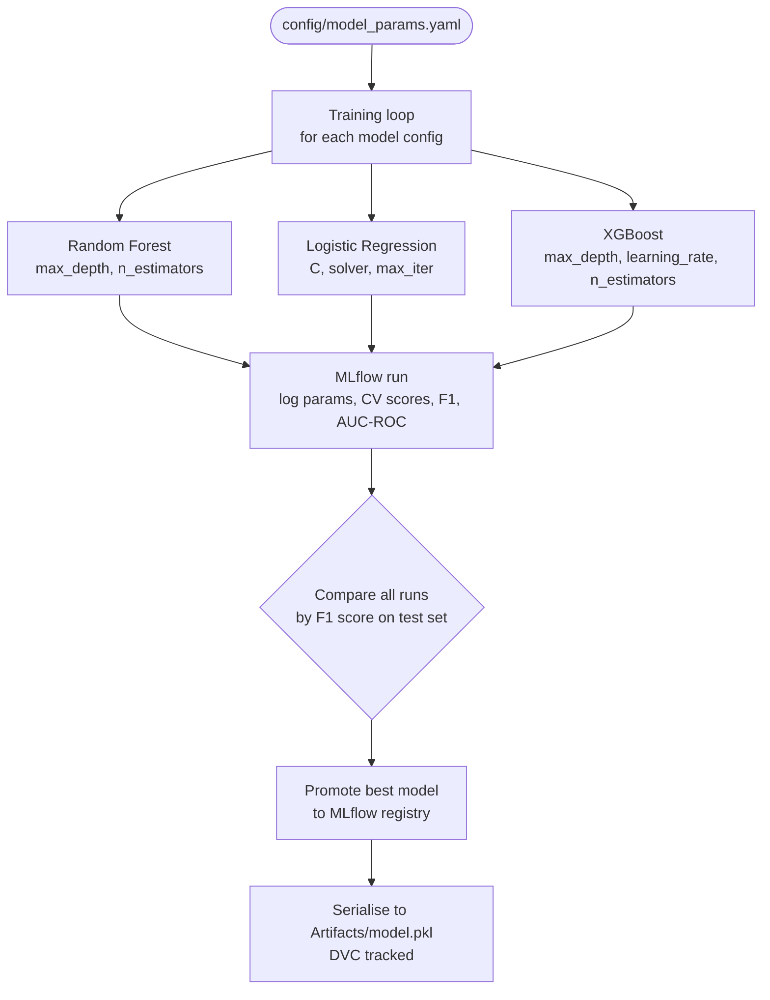
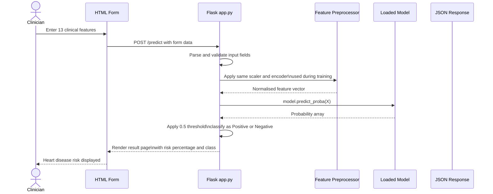
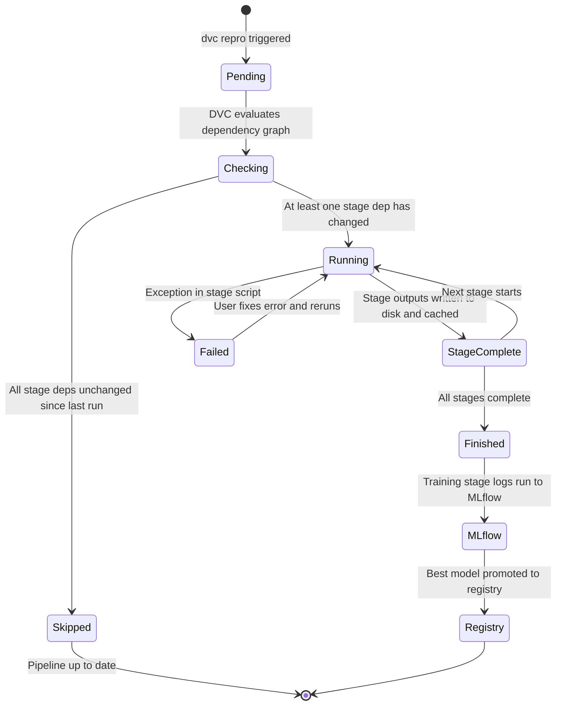

<div align="center">
<br/><br/>

<h1>Heart Disease Prediction.</h1>

<p><strong>A modular, production-grade end-to-end machine learning system for clinical heart disease risk prediction — powered by MLOps tools including DVC, MLflow, Docker, and GitHub Actions CI/CD.</strong></p>

<br/>

<a href="https://github.com/hardikkaurani/Heart-Disease-Prediction">
  
</a>


<br/><br/>

</div>

---

## Table of Contents

- [Overview](#overview)
- [ML Pipeline](#ml-pipeline)
- [MLOps Architecture](#mlops-architecture)
- [DVC Pipeline Stages](#dvc-pipeline-stages)
- [Model Training and Selection](#model-training-and-selection)
- [Prediction Inference Flow](#prediction-inference-flow)
- [Run State Machine](#run-state-machine)
- [Tech Stack](#tech-stack)
- [Dataset](#dataset)
- [Project Structure](#project-structure)
- [Environment Configuration](#environment-configuration)
- [Getting Started](#getting-started)
- [Running with Docker](#running-with-docker)
- [DVC Workflow](#dvc-workflow)
- [MLflow Tracking](#mlflow-tracking)
- [API Reference](#api-reference)
- [Testing](#testing)
- [CI/CD Pipeline](#cicd-pipeline)
- [Contributing](#contributing)
- [License](#license)

---

## Overview

This repository implements a complete, reproducible machine learning system for predicting the likelihood of heart disease from clinical patient features. It goes beyond a standard Jupyter notebook solution — every stage of the pipeline is modular, versioned, tested, and containerised, making the entire system reproducible from a single `dvc repro` command.

The project integrates three MLOps concerns that are typically treated separately:

- **Data versioning** with DVC: raw data, preprocessed features, and serialised models are all tracked as DVC artifacts with a remote storage backend, so any historical version of the data or model can be reproduced exactly.
- **Experiment tracking** with MLflow: every training run logs hyperparameters, evaluation metrics, confusion matrices, and the serialised model to MLflow's tracking server. The best model is promoted to the model registry.
- **Reproducible deployment** with Docker: the Flask prediction API and its model dependencies are packaged into a single Docker image, eliminating environment-related deployment inconsistencies.

Key design decisions:

- **Modular `src/` package**: each pipeline stage (ingestion, preprocessing, feature engineering, training, evaluation) is a separate Python module with a defined interface, making stages independently testable and replaceable.
- **`dvc.yaml` as the pipeline definition**: the full pipeline is declared as a DAG in `dvc.yaml`. DVC tracks dependencies between stages and only re-runs stages whose inputs have changed, making iterative development fast.
- **Model-agnostic training loop**: the training module accepts a model class and hyperparameter grid as configuration, making it trivial to add a new algorithm without touching pipeline code.
- **`setup.py` package installation**: the `src/` directory is installable as a Python package, meaning all imports work consistently across local development, Docker, and CI environments without `sys.path` manipulation.

---

## ML Pipeline

The end-to-end flow from raw data to a served prediction, across six stages.



---

## MLOps Architecture

How DVC, MLflow, GitHub Actions, and Docker fit together as a unified system.



---

## DVC Pipeline Stages

The `dvc.yaml` file declares the pipeline as a DAG. Each stage has explicit `deps` (inputs) and `outs` (outputs), so DVC can determine which stages need to re-run after any change.

```mermaid
flowchart LR
    RAW[(data/raw/heart.csv)] --> INGEST[data_ingestion\nsrc/pipeline/stage_01_data_ingestion.py]
    INGEST --> SPLIT[(data/interim/train.csv\ndata/interim/test.csv)]
    SPLIT --> PREPROCESS[data_preprocessing\nsrc/pipeline/stage_02_data_preprocessing.py]
    PREPROCESS --> FEATURES[(data/processed/features_train.csv\ndata/processed/features_test.csv)]
    FEATURES --> TRAIN[model_trainer\nsrc/pipeline/stage_03_model_trainer.py]
    TRAIN --> MODEL[(Artifacts/model.pkl)]
    MODEL --> EVAL[model_evaluation\nsrc/pipeline/stage_04_model_evaluation.py]
    EVAL --> REPORT[(Artifacts/metrics.json\nArtifacts/confusion_matrix.png)]
```



Run the full pipeline:
```bash
dvc repro
```

DVC skips any stage whose `deps` have not changed since the last run.

---

## Model Training and Selection

Three candidate models are trained, tracked with MLflow, and the best-performing model by F1 score is automatically selected and registered.



### Model Performance Reference

| Model | Accuracy | F1 Score | AUC-ROC | Notes |
|---|---|---|---|---|
| Random Forest | ~88% | ~0.87 | ~0.94 | Best overall, lowest false negatives |
| XGBoost | ~86% | ~0.85 | ~0.92 | Strong precision |
| Logistic Regression | ~84% | ~0.83 | ~0.91 | Fast, interpretable baseline |

> Exact metrics depend on random seed and dataset split. Run `dvc repro` and check `mlruns/` for precise values from your environment.

---

## Prediction Inference Flow

How a single patient record moves from raw form data through the Flask API to a final risk probability.



---

## Run State Machine

The state a DVC pipeline run moves through from trigger to completion.



---

## Tech Stack

### Machine Learning

| Library | Purpose |
|---|---|
| scikit-learn | Preprocessing, model training, cross-validation, evaluation metrics |
| XGBoost | Gradient boosted tree classifier |
| pandas | Data loading, manipulation, feature engineering |
| NumPy | Numerical operations |
| Matplotlib / Seaborn | Confusion matrices, EDA visualisations |

### MLOps

| Tool | Purpose |
|---|---|
| DVC | Pipeline DAG definition, data versioning, artifact tracking, remote storage |
| MLflow | Experiment tracking, run comparison, model registry, artifact storage |
| GitHub Actions | CI/CD — runs pytest and builds Docker image on every push to main |

### Serving

| Technology | Purpose |
|---|---|
| Flask | Lightweight REST API with HTML prediction form |
| Docker | Containerised deployment, reproducible environment |
| Jinja2 | HTML template rendering for the prediction UI |

---

## Dataset

The project uses the **UCI Heart Disease Dataset** (Cleveland Clinic Foundation), widely used as the standard benchmark for cardiovascular risk prediction.

| Feature | Type | Description |
|---|---|---|
| `age` | Numeric | Age in years |
| `sex` | Binary | 1 = male, 0 = female |
| `cp` | Categorical | Chest pain type (0–3) |
| `trestbps` | Numeric | Resting blood pressure (mmHg) |
| `chol` | Numeric | Serum cholesterol (mg/dl) |
| `fbs` | Binary | Fasting blood sugar > 120 mg/dl |
| `restecg` | Categorical | Resting ECG results (0–2) |
| `thalach` | Numeric | Maximum heart rate achieved |
| `exang` | Binary | Exercise-induced angina |
| `oldpeak` | Numeric | ST depression induced by exercise |
| `slope` | Categorical | Slope of peak exercise ST segment |
| `ca` | Numeric | Number of major vessels coloured by fluoroscopy |
| `thal` | Categorical | Thalassemia type |
| `target` | Binary | 1 = heart disease present, 0 = absent |

---

## Project Structure

```
Heart-Disease-Prediction/
|
+-- src/                                 # Installable Python package (setup.py)
|   +-- pipeline/
|   |   +-- stage_01_data_ingestion.py   # Load raw CSV, validate schema, train/test split
|   |   +-- stage_02_data_preprocessing.py # Imputation, scaling, encoding
|   |   +-- stage_03_model_trainer.py    # Train all models, log to MLflow, select best
|   |   +-- stage_04_model_evaluation.py # Final evaluation, confusion matrix, metrics.json
|   +-- utils/
|   |   +-- common.py                    # Config loader, logger, YAML helpers
|   +-- entity/                          # Pydantic dataclasses for config and artifact paths
|   +-- config/
|       +-- configuration.py             # Read params.yaml and config.yaml into typed objects
|
+-- Notebook_Experiments/                # Exploratory analysis and prototyping notebooks
+-- Artifacts/                           # DVC-tracked outputs - model.pkl, metrics, plots
+-- mlruns/                              # MLflow local tracking store
+-- static/                              # CSS and assets for Flask HTML UI
+-- templates/                           # Jinja2 HTML templates for Flask
+-- tests/                               # Pytest test suite
|   +-- test_ingestion.py
|   +-- test_preprocessing.py
|   +-- test_model.py
|
+-- .github/
|   +-- workflows/
|       +-- ci.yml                       # GitHub Actions - pytest + Docker build on push
|
+-- .dvc/                                # DVC configuration
+-- app.py                               # Flask application entry point
+-- dvc.yaml                             # Pipeline DAG definition
+-- dvc.lock                             # Locked dependency hashes for reproducibility
+-- Dockerfile                           # Multi-stage Docker build
+-- requirements.txt                     # Python dependencies
+-- setup.py                             # Installs src/ as editable package
+-- template.py                          # Project scaffolding script
+-- LICENSE
+-- README.md
```

---

## Environment Configuration

```env
# MLflow tracking URI (local by default, can point to remote server)
MLFLOW_TRACKING_URI=file:./mlruns

# DVC remote storage (optional - configure in .dvc/config)
# DVC_REMOTE_URL=s3://your-bucket/dvc-store

# Flask
FLASK_ENV=development
FLASK_PORT=5000
```

---

## Getting Started

### Prerequisites

| Requirement | Version |
|---|---|
| Python | 3.11+ |
| pip | Latest |
| Docker | v20+ (for containerised run) |
| Git | Any |

### Installation

```bash
# Clone the repository
git clone https://github.com/hardikkaurani/Heart-Disease-Prediction.git
cd Heart-Disease-Prediction

# Create and activate a virtual environment
python -m venv .venv
source .venv/bin/activate      # Windows: .venv\Scripts\activate

# Install Python dependencies
pip install -r requirements.txt

# Install the src package in editable mode
pip install -e .
```

### Run the Full ML Pipeline

```bash
# Reproduce the entire pipeline (DVC skips unchanged stages)
dvc repro

# Or run a specific stage manually
python src/pipeline/stage_01_data_ingestion.py
python src/pipeline/stage_02_data_preprocessing.py
python src/pipeline/stage_03_model_trainer.py
python src/pipeline/stage_04_model_evaluation.py
```

### Start the Flask API

```bash
python app.py
# API available at http://localhost:5000
```

---

## Running with Docker

```bash
# Build the image
docker build -t heart-disease-prediction .

# Run the container
docker run -p 5000:5000 heart-disease-prediction

# App available at http://localhost:5000
```

---

## DVC Workflow

```bash
# Check pipeline status - shows which stages are outdated
dvc status

# Reproduce outdated stages only
dvc repro

# Push artifacts to remote storage
dvc push

# Pull artifacts from remote storage
dvc pull

# Visualise the pipeline DAG
dvc dag
```

The `dvc.lock` file pins the exact hash of every input and output for the current pipeline run, ensuring byte-for-byte reproducibility.

---

## MLflow Tracking

```bash
# Start the MLflow UI (after running dvc repro)
mlflow ui --port 5001
# Open http://localhost:5001
```

The MLflow UI shows all training runs with their logged parameters, metrics, and artifacts. The best model is promoted to the model registry and loaded by the Flask API at startup.

Logged per run:
- All model hyperparameters
- Accuracy, F1 score, AUC-ROC, precision, recall on the test set
- Confusion matrix as a PNG artifact
- Serialised model as an MLflow artifact

---

## API Reference

| Method | Endpoint | Description |
|---|---|---|
| `GET` | `/` | HTML form for entering patient features |
| `POST` | `/predict` | Submit features, returns prediction and risk probability |
| `GET` | `/health` | Server health check |

**POST `/predict` — Form fields:**

```
age, sex, cp, trestbps, chol, fbs, restecg,
thalach, exang, oldpeak, slope, ca, thal
```

**Response (JSON):**

```json
{
  "prediction": "Positive",
  "probability": 0.82,
  "risk_level": "High"
}
```

---

## Testing

```bash
# Run the full test suite
pytest tests/ -v

# Run with coverage report
pytest tests/ --cov=src --cov-report=term-missing
```

Tests cover:
- Schema validation on data ingestion
- Correct output shapes from preprocessing
- Model training completes without error
- Flask API returns correct response format

---

## CI/CD Pipeline

The `.github/workflows/ci.yml` pipeline runs on every push to `main`:

1. Checkout code and set up Python 3.11
2. Install dependencies from `requirements.txt`
3. Install the `src` package with `pip install -e .`
4. Run `pytest tests/` — blocks merge if any test fails
5. Build the Docker image — confirms the container builds cleanly

---

## Contributing

```bash
git checkout -b feat/your-feature-name
git commit -m "feat: describe your change"
git push origin feat/your-feature-name
# Open a Pull Request
```

Follow [Conventional Commits](https://www.conventionalcommits.org/). All PRs must pass the CI pipeline before merging.

---

## License

GPL-3.0 License. See [LICENSE](LICENSE) for details.

---

<div align="center">

*Built by <a href="https://github.com/hardikkaurani">Hardik Kaurani</a> — modular MLOps, reproducible by design.*

</div>
